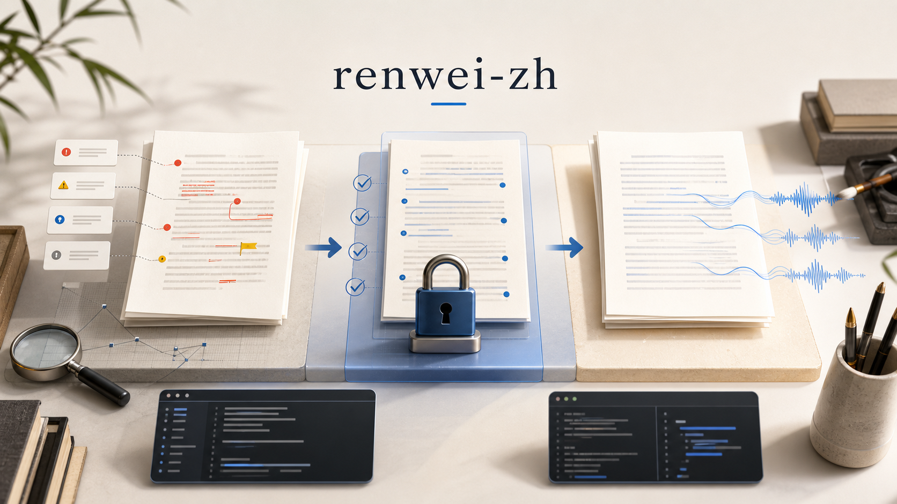
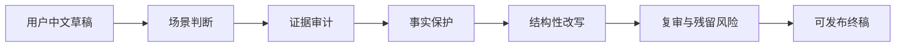

# renwei-zh



[](https://github.com/Zaoqu-Liu/renwei-zh/actions/workflows/ci.yml)

`renwei-zh` is a Chinese writing audit and revision skill. It helps users turn formulaic, model-like Chinese drafts into clearer, more credible writing while preserving facts and the author's voice.

It is not an "AI detector bypass" tool. It is a writing-quality tool for people who care about natural Chinese, factual safety, and repeatable review.

## What You Get

| User need | What renwei-zh does |
|-----------|---------------------|
| "这段中文太 AI 了" | Finds formulaic wording, syntactic shells, PR tone, overclaims, and model-like fingerprints. |
| "不要把事实改错" | Marks numbers, dates, citations, named sources, statistics, and claims as preservation-sensitive. |
| "我想知道哪里有问题" | Returns evidence, clusters, metrics, and prioritized guidance instead of vague feedback. |
| "我要在 Claude/Codex 里用" | Ships a compact `SKILL.md` with a Load Router and Golden Template. |
| "我要命令行/CI 可复现" | Ships a Python CLI with stable JSON output and tests. |

## 5-Minute Start

```bash
git clone https://github.com/Zaoqu-Liu/renwei-zh.git
cd renwei-zh
python3 -m venv .venv
source .venv/bin/activate
python -m pip install -e ".[zh]"
renwei-zh audit examples/11-pure-ai-rewrite/11-before.md --scenario business
```

No API key is required. The optional `zh` extra installs `jieba` for better Chinese tokenization. Without it, the CLI still works with a deterministic fallback tokenizer.

## Use It As A Skill

Symlink the repository into your Claude skills directory:

```bash
mkdir -p ~/.claude/skills
ln -s "$(pwd)" ~/.claude/skills/renwei-zh
```

Then use:

```text
/renwei-zh 请审计并改写这段中文产品发布稿。保留所有事实，不要新增数据。
```

The skill will follow this user-facing flow:



## Use It From The CLI

Human-readable report:

```bash
renwei-zh audit draft.md --scenario business
```

JSON report:

```bash
renwei-zh audit draft.md --scenario business --json > audit.json
```

Read from stdin:

```bash
cat draft.md | renwei-zh audit --scenario wechat
```

Exit codes:

| Code | Meaning |
|------|---------|
| `0` | Score is at least 70. |
| `2` | Score is below 70; structural revision is likely needed. |

## How To Read A Report

The CLI does not accuse a text of being AI-written. It reports editing evidence.

```text
Score: 0 / 100 (rewrite)
Evidence
- Red hits: 21
- Yellow hits: 5
- Clusters: 2
- Fact-risk items: 1

Guidance
- Fact guard: preserve numbers, citations, dates, names, and sources...
- Break dense clusters first...
- Priority pattern families: perfect_ending, product_pr, preposition_disease
```

Interpretation:

| Field | How to use it |
|-------|---------------|
| `Score` | Editing severity. It is not authorship proof. |
| `Red hits` | High-priority formulaic patterns to revise first. |
| `Yellow hits` | Softer evidence; only revise when dense or contextually wrong. |
| `Clusters` | Dense windows with multiple pattern families. Fix these before isolated hits. |
| `Fact-risk items` | Facts that must not be invented, deleted, or silently altered. |
| `Guidance` | The shortest path to a better rewrite. |

## Scenarios

Use `--scenario` to reduce false positives and get better guidance.

| Scenario | Best for | Protected style |
|----------|----------|-----------------|
| `business` | 产品稿、周报、提案、融资材料 | metrics, source attribution, risk boundaries |
| `academic` | 论文、摘要、基金、研究总结 | citations, p values, passive voice, nominalization |
| `official` | 公文、机构材料 | formal register |
| `wechat` | 公众号长文 | paragraph rhythm and author stance |
| `zhihu` | 知乎回答、知识解释 | technical specificity and personal experience |
| `xhs` | 小红书短内容 | price, product model, actual usage condition |
| `creative` | 小说、诗歌、文案 | voice, ambiguity, character diction |
| `general` | fallback | balanced defaults |

## Example Walkthrough

Try the dense business sample:

```bash
renwei-zh audit examples/11-pure-ai-rewrite/11-before.md --scenario business
renwei-zh audit examples/11-pure-ai-rewrite/11-after.md --scenario business
```

What you should notice:

- the before sample has dense PR tone, overclaims, perfect-ending language, DeepSeek-like imagery, and clustered formulaic structure
- the after sample keeps the business topic but becomes more concrete and less ceremonial
- fact-risk items remain visible because numbers and sources should still be protected

Examples live in:

```text
examples/
├── 01-xhs-skincare/
├── 03-wechat-essay/
├── 07-deepseek-imagery/
└── 11-pure-ai-rewrite/
```

## Configuration

Most users only need `--scenario`.

Advanced users can edit the default rule catalog:

```text
src/renwei_zh/data/patterns.v1.json
```

Repository rule:

- add new default rules to the catalog
- do not duplicate regexes in standalone scripts
- add tests or false-positive notes for high-severity rules

## Install Troubleshooting

If `renwei-zh` is not found:

```bash
source .venv/bin/activate
python -m pip install -e ".[zh]"
python -m renwei_zh audit examples/11-pure-ai-rewrite/11-before.md
```

If package installation is blocked by your system Python, use a virtual environment:

```bash
python3 -m venv .venv
source .venv/bin/activate
python -m pip install -e ".[zh]"
```

If you only need the skill and not the CLI, symlink the repo into `~/.claude/skills` and use `/renwei-zh` directly.

## Project Layout

```text
.
├── SKILL.md                 # Claude/Codex skill entry point
├── src/renwei_zh/           # Python package and CLI
├── src/renwei_zh/data/      # Single source for default audit rules
├── references/              # Deep scenario and pattern knowledge
├── examples/                # Before/after samples
├── assets/                  # README and project visuals
├── tests/                   # Regression and contract tests
├── benchmarks/              # Corpus layout for future calibration
└── .github/                 # CI, issues, PR template
```

## Development

```bash
python -m pip install -e ".[dev,zh]"
python -m pytest
python -m ruff check .
python -m mypy src
python -m build
```

## Responsible Use

Use this project to improve writing quality, not to fabricate authorship, fake citations, impersonate someone, or evade required AI-use disclosure.

Text-only signals have limits. Treat `renwei-zh` reports as editing evidence, never as proof that a person did or did not use AI.

## License

MIT.
